# Project 2: Design Journey

**For each milestone, complete only the sections that are labeled with that milestone.**

Be clear and concise in your writing. Bullets points are encouraged.

**Everything, including images, must be visible in Markdown Preview.** If it's not visible in Markdown Preview, then we won't grade it. We won't give you partial credit either. This is your warning.

## Understanding Users (Milestone 1)

**Make the case for your decisions using concepts from class, as well as other design principles, theories, examples, and cases from outside of class.**

You can use bullet points and lists, or full paragraphs, or a combo, whichever is appropriate. The writing should be solid draft quality but doesn't have to be fancy.

### Audience (Milestone 1)
> Briefly explain your site's audience. Be specific and justify why this audience is a cohesive group with regard to the Ithaca Apple Harvest Festival. .

My intended audience is new nearby residents and/or distant visitors/residents who are interested in socializing, learning and enjoying good local food and entertainment. As the Ithaca Apple Harvest Festival is a communal activity, those who are new nearby residents or distant visitors/residents won't be as familiar with the festival as other residents in the town. Thus, they all represent a cohesive group that is more inclined to utilize the website to learn more about the festival and get a sense to what the festival is really like.

### User Interview Questions (Milestone 1)
> Plan the user interview which you'll use to identify the goals of your site's audience. You may use the interview template below and revise it as much as you desire. You are **required to author 3 of your own questions**..

**User Interview Briefing & Consent:** Hi, I am a student at Cornell University. I'm currently taking a class on web design and for a project, I am re-designing the web site for Ithaca's Apple Harvest Festival. I'm trying to learn more about the people that might use this site. May I ask you a few questions? It will take about 10 minutes. You are free to quit at any time.

(These questions assume you are interviewing a festival attendee at the festival. If you didn't attend the festival, you may revise the question an instead ask the participant to recall the last festival/event they attended. Do not ask them to speculate about visiting the Apple Harvest Festival. User speculation provides biased data.)

1. Please tell me a bit about yourself. You may omit any personal or private information.

2. What brought you to visit the Apple Harvest Festival today?

3. Before you came to the festival today, did you seek out any information about the festival before getting here?
3a. If yes, What information were you looking for? Did you find it? How did you access that information?

4. When you arrived at the festival, did you seek out any information about the festival?
4a. If yes, What was that information? How did you obtain it?

5. Now that you're here participating in the festival, have you sought out information about the festival?
5a. If yes, how easy or difficult was it for you to sought out information about the festival when you got here?

6. Is there any information you wish you had known about the festival beforehand or information that you weren't able to find?

7. What part of the festival particularly grabbed your attention?

8. Were you aware that there's a website regarding the festival?
8a. If yes, how useful was it in helping you plan your visit?

...

n. What haven't I asked you today that you think would be valuable for me to know?

**After the interview:** This was really helpful. Thank you so much for agreeing to speak with me today. Have a great day!

### Interview Notes (Milestone 1)
> Interview at least 3 people from your audience. Take notes and include those notes here. Make sure to include a brief description of each interviewee.

**Interviewee 1:**

- First year Cornell University student originally from California. She has minimal knowledge/experience of the festival and Ithaca in general.
- Wanted to visit the Apple Harvest Festival as a means of socializing with her friends and exploring downtown Ithaca.
- As the respondent has an undisclosed health condition, she was curious to know what kind of policies were set in place in regards to COVID-19. She was able to easily obtain the information by accessing the home page. She didn't recall any particular obstacle in obtaining the information.
- When the respondent initially arrived at the festival, she didn't seek out any information about the festival, rather followed the general movement of other participants to guide her.
- She was curious about where the cider donuts were sold, as it is something that have been commonly talked about among her friend group. She obtained the information by asking another participant of the festival for the direction for the vendor.
- When she was looking for vendors that sold cider donuts and other vendors/restaurants for food, she was taken back by how many people were waiting in line. She had wished there was live estimated time of the wait.
- The respondent was initially mostly drawn to the food truck that sold mac n cheese and fried chicken since that's where it seemed the most crowded while she was there.
- The respondent was aware of the website, yet it wasn't much of a help/interest.  

**Interviewee 2:**

- Resident from Syracuse, who got the chance to participate in the festival after the pandemic has subsided.
- The responded decided to attend the festival to experience not only the tightly knitted community of Ithaca but also try local goods and build memories with his wife and children
- The respondent wanted to know how long the festival will be held for, as well as the kind of vendors/entertainments that will possibly be available for his children. He thus utilized the downtown Ithaca website in order to learn more about the festival hours. He also searched if there would be public parking spots available near the festival or if it would be better to park in a neighborhood and utilize public transportation. The respondent obtained this information by scrolling to the bottom of the home page, which he couldn't find until he looked through other pages.
- The general direction/flow of the festival, which was obtained by looking at the down town Ithaca website. He was also interested in knowing when Brassband is performing, as the band has been mentioned among his group of friends who previoulsy saw them live.
- The respondent wasn't particularly seeking out for any information when him and his family arrived at the festival. Rather, they were keen to walk around and explore.
- The second respondent also wished that he knew how occupied the festival is in advance to be more efficient with the trip with his family.
- The respondent was particularly impressed/amused by the variety of local produce as well as entertainment/activities, Brassband in particular, throughout the time they were there.
- The respondent was aware and believed the website was sufficient in planning his visit with his family.

**Interviewee 3:**

- New resident who recently moved to Ithaca and is in search of getting to know more about the town and the people.
- The respondent mainly attended the festival as an opportunity to get a feel of her new town and experience the atmosphere the town and the people bring.
- The respondent initially came to know about the festival and through social media, specifically Instagram. She was particularly interested in the post they made about local bands/groups performing. She thought it was a good way to get introduced to the town and people, looked further into the website in order to know the hours.
- The respondent didn't initially seek out any information about the festival, as everything was new to her. She took the time to observe and absorb all the different elements of the festival.
- The respondent asked a couple of participants who were waiting in line for food trucks if they knew how long the expected wait would be. Unfortunately, it was difficult for her to exactly know how long it would take for the lines clear as no one really knew either.
- The respondent mentions that she had wished how busy the festival would be in advance. Specifically, she emphasizes it would've been helpful to know the general expected time for food trucks and restaurants so that she can come up with a different plan if there is time conflict. She also mentions she had a bit of trouble with parking with how crowded the festival was.
- The respondent mentions not only was she taken back by the variety of fresh produce and eateries available, but also the performance by different bands were impressive.
- The respondent was aware of the website as momentarily visited the website to check the hours. However, she notes that from the brief use of the website, the lively, ambient atmosphere that can be felt in person doesn't quite hold up in the website.

### Goals (Milestone 1)
> Analyze your audience's goals from your notes above. List each goal below. There is no specific number of goals required for this, but you need enough to do the job (Hint: It's more than 1 and probably more than 2).

Goal 1: Not only to utilize more effective information but also organize it better
- **Design Ideas and Choices** _How will you meet those goals in your design?_
- Upon analyzing the responses, many respondents mention the information they wished to see on the website that would make the website more effective to use. For example, many respondents struggled with the lack of knowledge on how long the wait time for food vendors were. In addition, the respondents also note that the website fails to encompass and highlight what makes the festival interesting. Thus, by refining these aspects of the website, through providing graph/visual aid of the wait time and contents to highlight key aspects of the festival.
- **Rationale & Additional Notes** _Justify your decisions; additional notes._
- Throughout the interviews conducted, I have received several comments regarding the lack of knowledge the participants were provided with given the waiting line for food vendors. In addition, for some, the website seemed to be inefficient in advertising or evoking people's desire to participate. By doing so, not only will the website be able to bring more people together and thus create a more lively atmosphere, information such as visual aid of expected waiting time can assist the participants with planning their trip before and during the festival.

Goal 2: Creating a more visually enticing website
- **Design Ideas and Choices** _How will you meet those goals in your design?_
- In order to create a more visually enticing website, several elements could be incorporated. For example, including more pictures that adequately capture the ambiance and the atmosphere of the festival could be a great way to grab the visitors' attention. In addition, adequate use of stylistic elements such as variety of font families, visually appealing color combinations, and etc. can be effective in attracting the visitors.
- **Rationale & Additional Notes** _Justify your decisions; additional notes._
- Two out of the three interviews conducted mentioned that either the original website doesn't look particularly interesting or fails to encompass the great energy the participants might experience in person. Thus, incorporating aesthetically pleasing pictures that well capture what the festival is like in person could be visually enticing. In addition, a good mix of color combinations can evoke different emotions similar to how fonts carry the same effect. Thus, utilizing these design elements to evoke certain emotions can gravitate the audience.

Goal 3: Highlighting key elements of the festival
- **Design Ideas and Choices** _How will you meet those goals in your design?_
- One way to highlight key elements of the festival is by establishing hierarchy. As hierarchy refers to having a sense of structure in a specified order, to emphasize certain elements, increasing the size of the font and/or adding background images that will guide the audiences' eyes to the desired content.
- **Rationale & Additional Notes** _Justify your decisions; additional notes._
- The highlight of the festival, as the respondents have mentioned, are the various activities/entertainments, local produce, and eateries the festival provides. Thus, it is apt to highlight these aspects of the festival accordingly to the audiences' interest and attention.

## Content Planning (Milestone 1)

Plan your site's content.

### Your Site's Planned Content (Milestone 1)
> List the content you plan to include your personal website. This should be a comprehensive list.

- Brief overview of the festival providing preface as to what the festival is about
- Visual aid such as map and estimated waiting time tracker
- COVID safety policy
- Introduction of four highlighted segments of the festival
  - Eateries+Local Produce such as various food trucks and fresh produce provided by local businesses.
  - Activities+Entertainments such as bands and performance groups
- information regarding parking and transportations

### Content Justification (Milestone 1)
> Explain (about a paragraph) why this content is the right content for your site's audience and how its addressed their goals..

I think the content listed are adequate for the site's audience. Upon analyzing the responses from the short series of interviews, though it's a relatively small sample size, the general consensus is that the original website could be refined functionally and aesthetically. Those points consisted of lacking practical information such as estimated wait time, which proved to be crucial for visitors' planning of the trip. In addition some of the responses mentioned the existing website's dull presentation of what are supposed to be the highlight/main events of the festival. Thus, not only will these contents provide a sense as to what the festival will really be like, but also work in conjunction to help the visitors to optimize their plan accordingly. For example, if a particular visitor isn't keen about long waiting line, the expected wait time can efficiently inform the visitor and he or she can thus change the plan in advance. In similar stance, information regarding parking and transportation can help those coming from long distance reduce the hassle and plan their trip efficiently. Similarly, the rich information regarding the festival (eateries, entertainment, and etc.) will provide a clear idea as to what each parts are like, allowing visitors to either focus on all parts of the festival or pick certain parts of the festival they are particularly interested in and tailor their plan accordingly for the given time they have. Furthermore, "activities and entertainments" page could be a great way to introduce the audience to some of the local performance groups/bands and also encouraging them to check them out. By bringing more attraction to the enetertainment aspect of the festival, more people can come together and enjoy the festival as a group.

## Information Architecture (Milestone 1)

### Content Organization (Milestone 1)
> Document your iterations of card sorting here.
> Include photographic evidence of each iteration of card sorting and description of your thought process for each iteration.

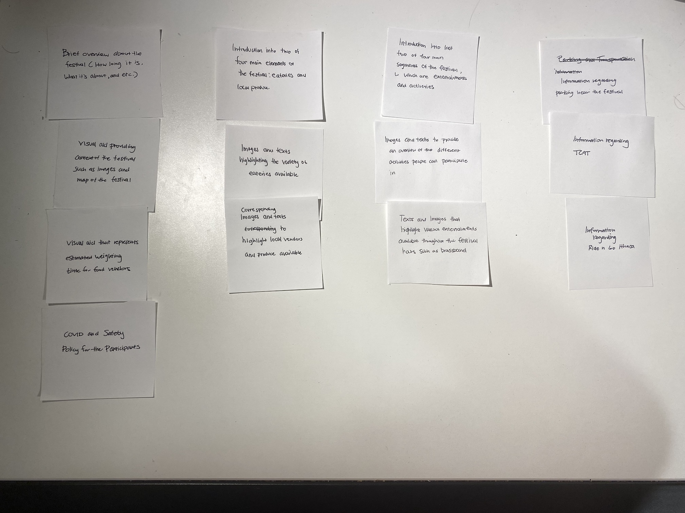
This iteration of card sorting follows my natural intuition as to how the content should be categorized/organized. In this iteration, upon entering the website, the home page provides a brief overview of the festival as well as general information regarding maps, festival hours, and etc. I felt that this was necessary because home page should contain information that provides context to the overall website and provide any information that should be obtained quickly. Thus, the visual aid for the expected wait time has also been placed in the home page as seen in the interviews, it is an information that was highly discussed among the respondents. Then, the two trailing pages highlight the key elements of the festival. I've grouped "eateries" and "local produce" together and "entertainment" with "activities" based on the similarity between each. Lastly, I've dedicated a separate page regarding "Parking and Transportation" as I felt that this content needs its own place as it contains considerable amount of information.

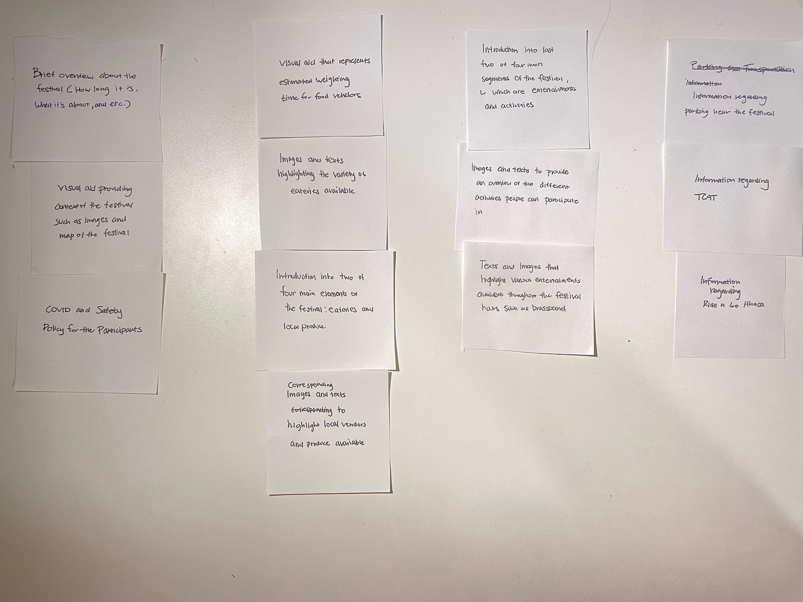
Though this iteration only slightly varies from the previous iteration as the visual diagram for the expected waiting time for food vendors have been relocated to the second page. Although this may seem like a miniscule change, I felt that this could totally change how an user might navigate through the site. By relocating the discussed information to a different page, I felt that this could make the sorting of information feel more cohesive in a sense that similar/relevant topics are all sorted into a page. In addition, having an information-heavy home page could intimidate/overwhelm the user with ovoerload of information, thus I felt that it could be a good way to distribute the load of information more evenly.

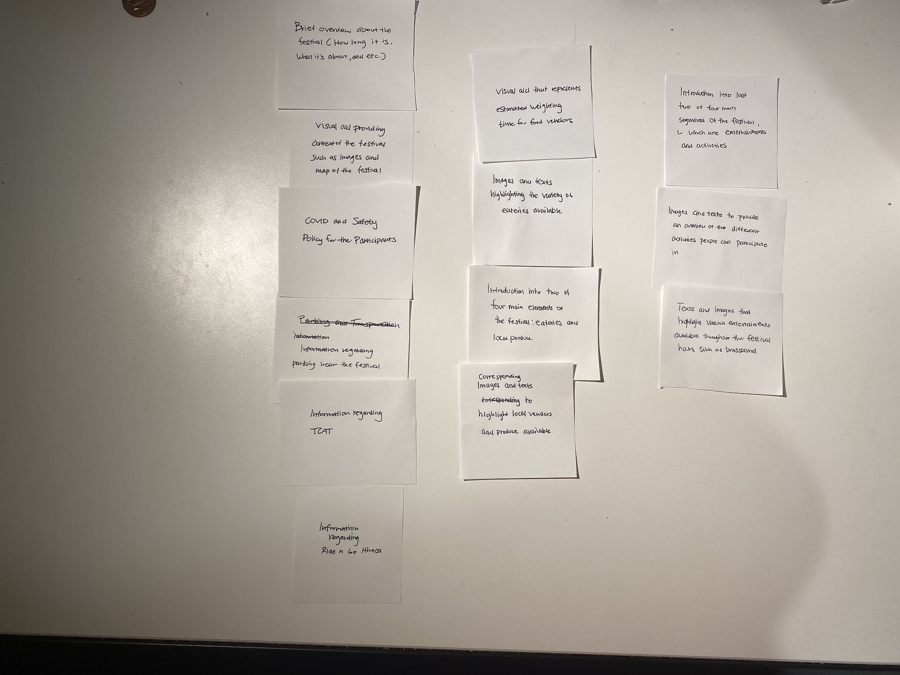
Lastly, this iteration of card sorting is largely different from the other two. In comparison to the other two iterations, this introduction contains the most amount of content. In the home page, in addition to the general overview of the festival, information regarding parking and transportation has also been included. I also felt that this sorting could be effective as information regarding parking and transporation proved to be useful according to the user interview. However, in retrospect, I feel that when viewed in mobile layout, the amount of information provided could force the users to scroll too much, which could be inconvenient. In the two trailing pages, the information that introduces the highlights of the festival has been sorted in the same manner as the first iteration. They have been sorted based on their relevance to one another, in order to present the information as efficently as possible.

### Final Content Organization (Milestone 1)
> Which iteration of card sorting will you use for your website?

I will be using the first iteration of card sorting for my website.

> Explain how the final organization of content is appropriate for your site's audiences and their goals.

The final organization of content is appropriate for the site's audience and their goals. I feel that this organization efficiently lays out important information that the audience needs to quickly access, whether for planning the visit or during the festival. For example, contents such as maps, estimated wait time tracker, and festival hours are informations that respondents of the interviews have frequently mentioned. By locating these set of information in the home page, it minimizes the users' need to think and navigate for the most demanded set of information.In other pages, the content is divided cohesively. For example, a page is solely dedicated to eateries and local produce as both attractions consist of consuming something. Hypothetically, it is likely that audience who might be particularly interested in eating festival foods also want to learn more about trying different fresh produce. This way, the users have all the relevant information in one page. Similarly, another page cohesively contains information regarding activities and entertainments. For the same reason as eateries and local produce, activities and entertainments have similarity that allows them to be grouped for efficient content organization. Furthermore, by highlighting a featured performance or activity in the "entertainment spotlight", it could be an effective way to draw in my intended audience to not only further explore the website but also actually feel inclined to actually visit and be a part of the crowd at the festival. Lastly, I felt that "Parking and Transporation" needed its own page as there is a substantial amount of content. Thus, combining with other set of information can overwhelm the audience with overload of information. Thus, by creating a separate page, the content can be easily accessed without the distractino of other contents.

### Navigation (Milestone 1)
> Please list the pages you will include in your personal website navigation.

- Home Page
- Eateries & Fresh Produce
- Activities & Entertainment
- Parking & Transportations

> Explain why the names of these pages make sense for your site's audience and their goals.

The names of these pages make sense because they all efficiently portray what kind of content is available in each page. They don't make the visitors "think," which is important when the website is intended to inform the visitors with adequate information they need to plan their visit. The home page is important in that it makes up the users' first impression regarding the website will be like. "Eateries & Local Produce" and "Activities & Entertainment" are straightforward names that not only preview what the content will exactly be about but also highlight what is deemed as the most anticipated/exciting part of the festival according to the the responses collected from the interview. Lastly, "Parking & Transportations" is also straightforward and concise in providing the user with the information with what the page will be about.

## Visual Theme (Milestone 1)
> Discuss several (more than two) ideas about styling your site's theme. Explain why the theme ideas are appropriate for your target audiences. Note the theme you selected for you site and why it's appropriate for the audience and their goals.

- One idea about styling the site's theme is incorporating design strategies that is modern. Based on the audiences' needs, there is a lot of information that must be placed in each website. Thus, having a modern/minimal theme with minimal and structured feel can help the users browse through the information with minimal effort. This can be done with the incorporation of many different stylistic elements. For example, use of certain font families such as sans-serif give off the modern and minimal feel. In addition, adequate use of white space as well as colors that are more neutral can all help to emanate this theme.
- Another idea for styling the site's theme is revolving around the theme of making the website friendly/approachable. As noted, the design of this website is geared towards my intended audience, specifically people who are visiting from long distance or people who are wanting to get to know more about the town they are newly residing in. Thus, in order for the intended audience to be inclined to participate in the festival, the website they're using must feel approachable and friendly. This can be accomplished by utilizing color schemes that evoke welcoming emotions. In addition, use of family fonts that consist of round edges can evoke friendliness in contrast to the formal feeling hard edges give off.
- Lastly, vintage/retro could be another effective theme for the website. As mentioned above, the audience is anyone from long distance or newcomers of the town who are not only curious to explore various eateries and such the festival provides, but also the atmosphere and tradition of the festival. Given that the festival has been taking place for almost 40 years, using stylistic elements can help create a feeling of yesteryear. For example, utilizing family fonts such as serif emanates a sense of history and tradition. In addition, utilizing neutral colors and patterns that are predominantly seen in the past can help to emphasize the theme.

The theme I will be incorporating for this website is the second theme, which revolves around friendliness/approachability. As previously mentioned, as the intended audiences are those who are new to the festival and want to be a part of a tightly knitted community, the audiences should feel inclined to actually participate in the festival upon entering the website. Thus, the website should serve to gravitate these audiences in feeling the same way when using the website as well. Friendliness and approachability can also mean in the context of functionality as well. For the intended audience, it is important that the users can easilya navigate throgh the website both in mobile and desktop layout. Thus, by having a friendly layout, which would mean good structure, use of inviting colors, visibility, hierarchy, and more, the users will be able to utilize the website to not only obtain the information they need but also enjoy browsing through the website.

## Design (Milestone 1)

Document your site's layout.

### Layout Exploration (Milestone 1)
> Iterate on your site's design through sketching.
> Sketch both the mobile and desktop versions of the site.
> Here you are just exploring your layout ideas. You don't need to sketch every page.
> Provide an explanation for each sketch explaining the idea and the design patterns you are leveraging.

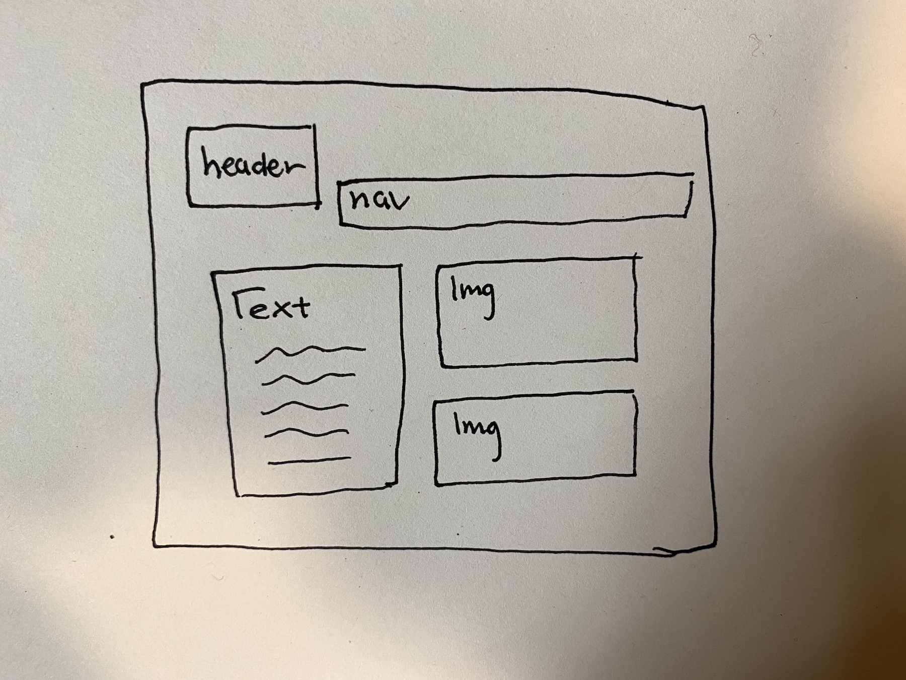
This iteration of design for the home page is what I think is a standard layout for a website. I felt that this layout can efficiently help the audience navigate through through the texts and images with fluidity. It adheres to the users' natural reading pattern, left to right. By having the texts aligned to the left hand side, it gives a feeling of structure and stability, which is what the users might want when they enter the website. They want the website to feel structured and organized enough for them to easily navigate through all the information they need.

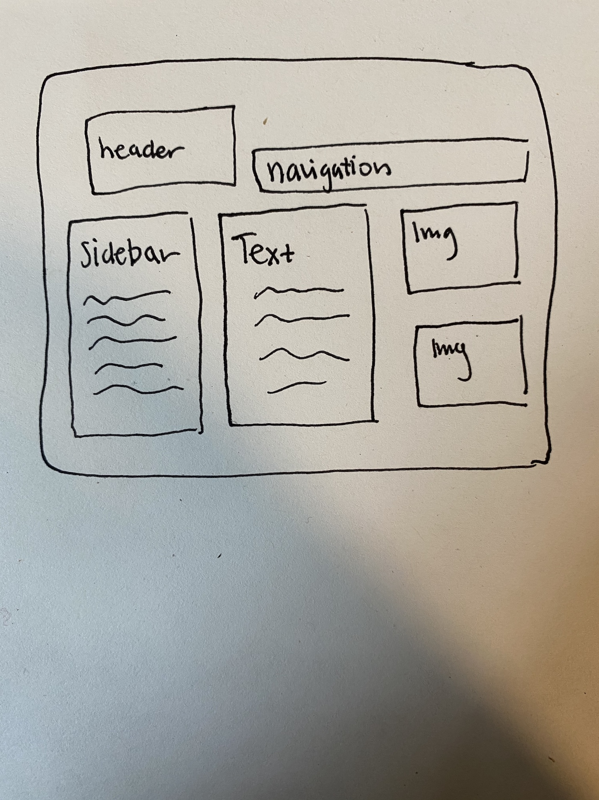
This iteration of design is similar to the previous iteration, but includes a sidebar. With the addition of a sidebar, I felt that small, yet important information such as estimated wait time for eateries/vendors could be efficiently highlighted. By utilizing the sidebar, it establishes hierarchy as well as distinction as it allows you to group the information. The layout still stays coherent with the audiences' natural reading pattern of left to right directionality.

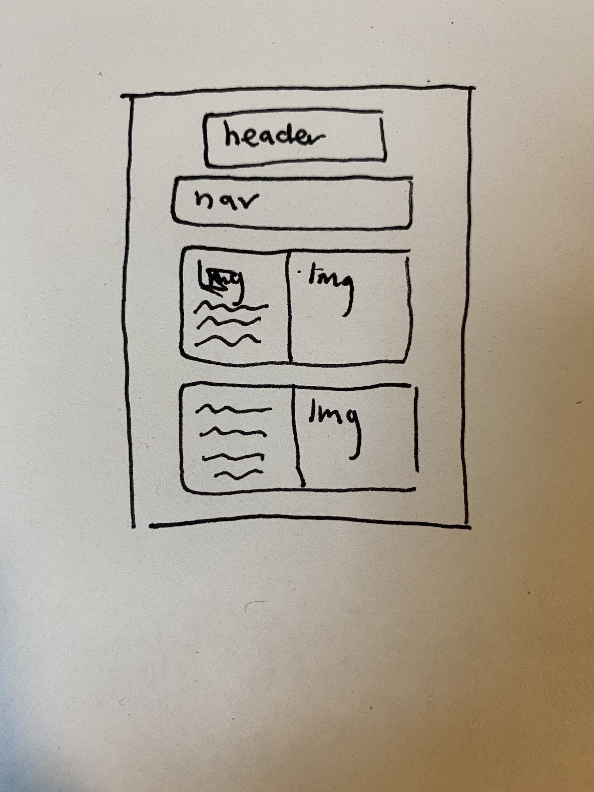
This iteration is a layout for mobile devices. Since the given width of the layout will be much narrower than that of desktop, I tried to take a top to bottom approach to the layout. For example, the navigation bar is situated below the header. Still, I felt it was necessary to align the texts on the left hand side with the images on the right, as this adheres to the most natural form of reading. However, given how narrow the mobile layout is, I feel that having both the texts and images horizontally can disrupt the content from being displayed smoothly for the users.

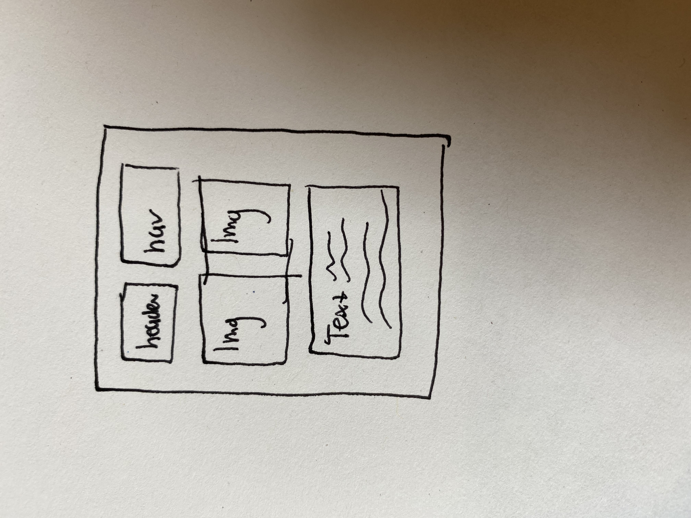
The second iteration of mobile device layout mainly differs from the previous iteration in that the navigation bar is next to the header and the text and the images are stacked vertically. However, it's important to note that the images come beforehand in the case of mobile devices. Given how narrow and small the over size is in comparison to desktop, I did not want to overwhelm the audience with texts upon first entering the website. Rather they can observe the image before to get a sense of what kind of information the texts will contain. However, this variation of the navigation bar, which is laid out horizontally, might not be effective in the case of mobile layout. Again, given the narrow width of the lay out, having the navigation bar horizontally might not be effective, especialy due to the fact that mobile layout is navigated using fingers, not mouse. Meaning, the navigation needs to have enough room to account for error that comes from navigating with fingers.
### Final Design (Milestone 1)
> Include the final sketches for each of your pages.
> The sketches must include enough detail that another 1300 student could implement them.
> Provide a explanation for each sketch.

**Mobile Design:**
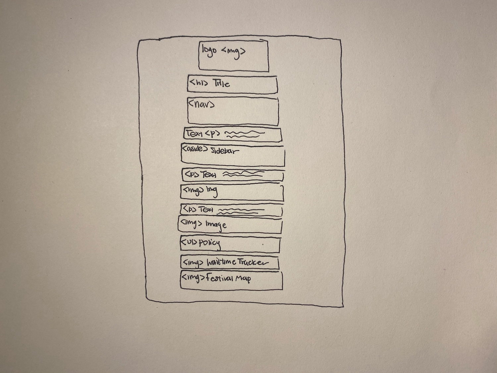
The layout of the home page follows a vertical approach. Meaning, in contrast to the desktop layout, the information is arranged on top of one another. This was mainly done in order to accomodate for the narrow width of mobile devices. It also maintains hierarchy of information, with header and navigation bar followed by sidebar, which contains content that has been frequently discussed in the interviews. The sidebar is especially effective in the case of the home page where there is more information to navigate through because with the use of "shortcut" located in the sidebar, the users are able to quickly cut through the information they have planned to look for. Thus, for those in hurry or those who exactly know what they're looking for, scrolling will be minimized. Similarly, the navigation bar is also displayed vertically as due to the narrow width of the mobile layout. The background color of the sidebar and rest of the content also are different colors, in order to make it easier to distinguish the layout and content provided. Then, the sidebar is followed by a brief description of about the festival. In the case of the layout for mobile device, I found it apt to place the images before the corresponding texts, as texts might be overwhelming for the audience to first encounter. Similarly, in order to stay coherent with the theme of approachability/ friendliness, the overall tone of the website is vibrant with toned-down color palettes to emphasize the emotion but not hurt the users' eyes.  In addition, the fonts have been spaced out and scaled accordingly to match the restriction of the layout.
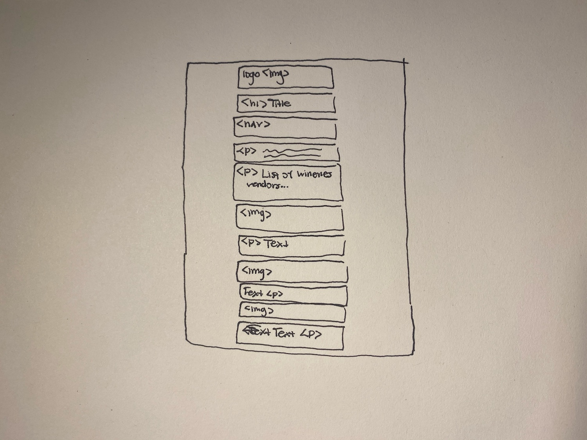
Similar to the home page, the second page also takes on a vertical approach. Most notably, there is a stack of images and texts that begin with a short text. By starting with a short text, it doesn't overload the users with information but it provides just enough information with context for the users. Then, by having each image for the topic followed by text, not only does this eases the readers into the content with visual aid but also stays cohesive to the design layout of the home page. Structurally, this page stays consistent with the home page as familiarlity of layout is an important element in developing a friendly/approachable website for the users. Similarly, in order to stay coherent with the theme of approachability/ friendliness, the overall tone of the website is vibrant with toned-down color palettes to emphasize the emotion but not hurt the users' eyes. In addition, the fonts have been spaced out and scaled accordingly to match the restriction of the layout.
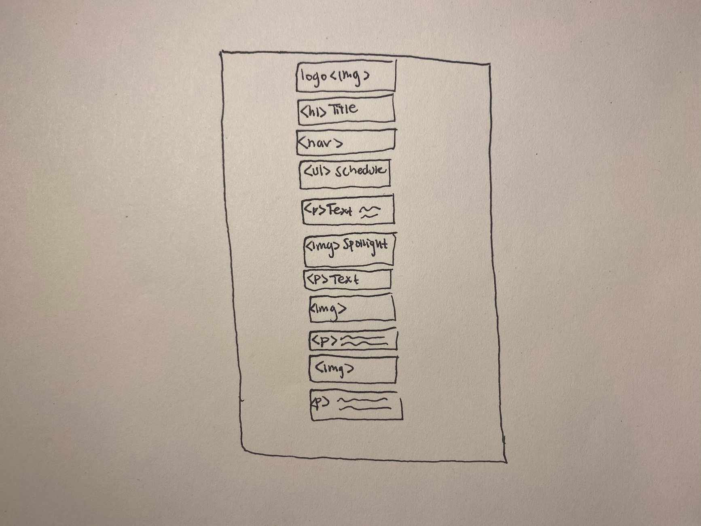
Same approach that has been taken in previous page is also applied to this one as well. This was done mainly to keep the overall webpage coherent in terms of layout as familiarity of structure and layout is an important aspect of friendly design. The only exception is that the page begins with information regarding the performance schedule of the performance groups and bands. This is because according to the user interview that has been conducted, the respondents have frequently mentioned their interest in what kind of groups/bands will be performing and when. Thus, given that the information is prioritized, the information has been located first, followed by images and texts regarding the activities and entertainments users can experience. This page also places effort to stay coherent with the theme and style of earlier pages. The color scheme for the most part stays coherent in order to emanate the same emotions and feelings. Also, the use of font sizes, heights, and etc. have been all adjusted, as previously mentioned, to help the users navigate and absorb the information in an efficient and friendly manner.
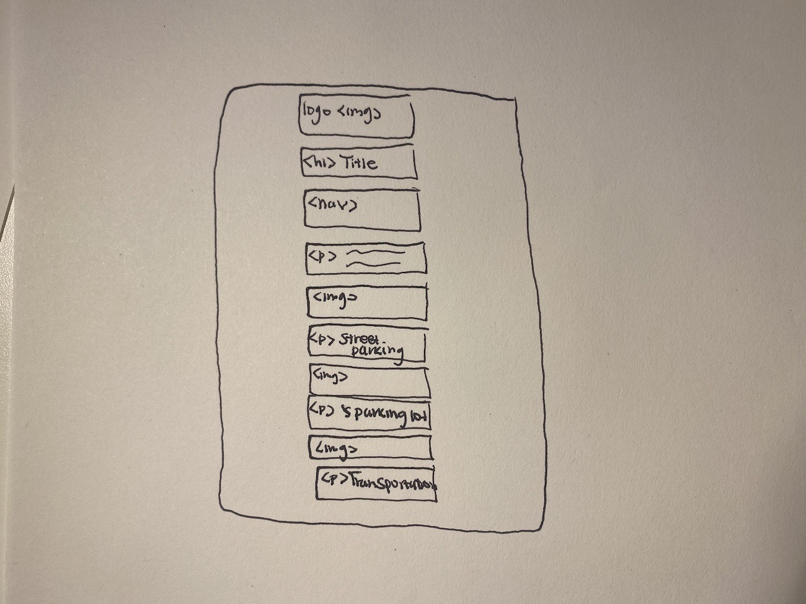
The last page also maintains the same structure and style as the rest of the pages, mainly to stay coherent with the structure of the other webpages. This is an important element of webpages as I felt that staying consistent with layout of the pages will not only make the overall website organized and refined, but also help the users familiarize with how the contents are structured. Thus, by replicating the layout of the pages, the users are aware and familiar that each pages are structured the same, giving them confidence and knowledge to navigate through information easily.

**Desktop Design:**
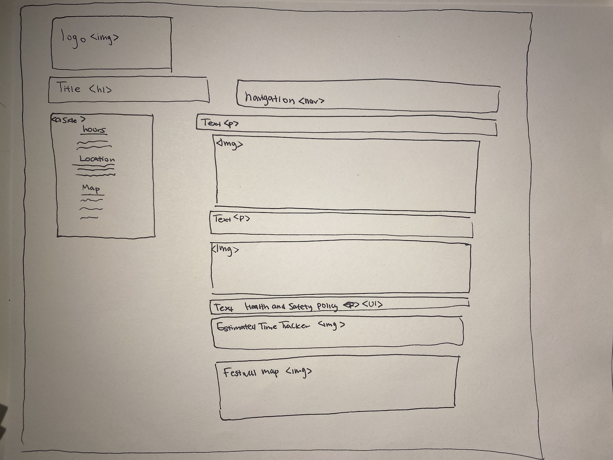
The layout/design of the home page for desktop mainly focuses on the hierarchy of information along with friendly design for the audience. For example, by utilizing a sidebar for information such as festival hours, estimated wait time, etc. directly grabs the audiences' attention as it adheres to their natural reading pattern (left to right) as well as the hierarchy established by the contrasting background color of the sidebar. Then, the text and images that provide a brief overview of the festival is arranged sequentially. By having a short text at the top of the page, it welcomes the users and provides context as to what the webpage will be about, as opposed to having body of text or an image can confuse the users at first sight. The websites also incoroporate variety of color schemes that work to evoke the emotions of friendliness/approachability, similar to the mobile layout. In addition, the sidebar and the rest of the content also carry different color, the same way the mobile design does to help distinguish/separate the content.
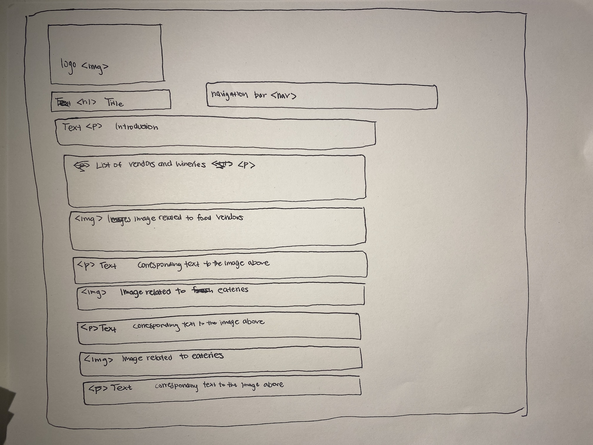
The layout of the second page is quite similar to that of the home page, without the sidebar. As the page serves to provide an in-depth overview of the eateries and local produce available, including a sidebar seemed unnecessary. Rather, by having a simple layout that adheres to the audiences' reading pattern, the audience is able to fully immerse themselves in the content provided and learn more about what makes this festival great. Similarly, the simply layout consisting of alternating texts and images are what I think is the simplest yet most effective layout that can stay coherent throughout different layout such as that of mobile design.
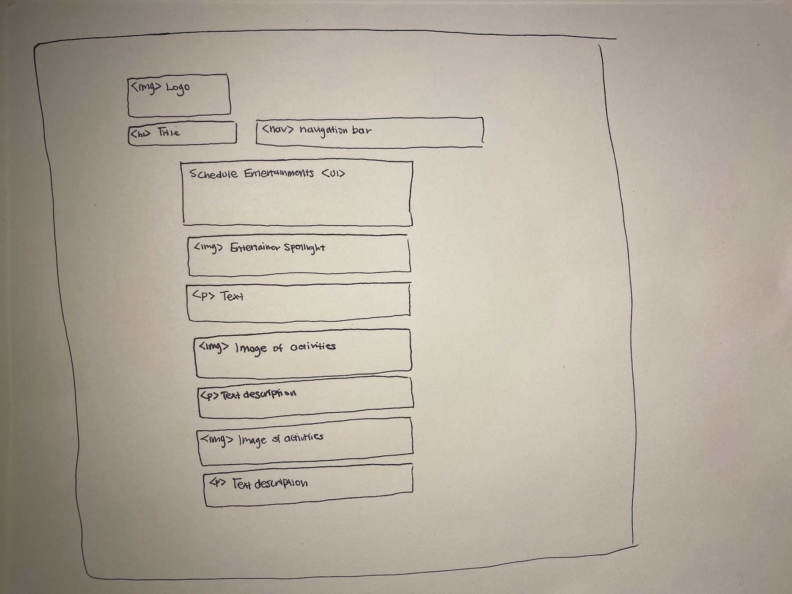
The layout of the third page stays consistent with the previous pages in order to keep the audience familiar with the overall structure/layout of the pages. As this page serves the same purpose as the second page, except it discusses entertainments and activities available at the festival, it was especially important that the structure remains the same. The page however begins with the schedule of performance groups and bands as it is an information that has been discussed by the respondents during the user interview. Thus, to highlight the information seemlessly, I utilized placement of the content in order to establish hierarchy.
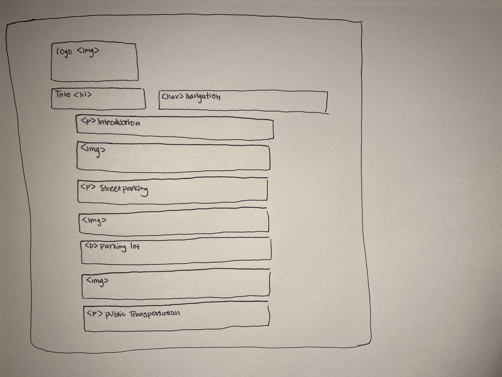
Lastly, page regarding parking and transportation also takes on a very similar layout in comparison to the previous pages. Although this page has more room in comparison to other pages, I felt that it should remain that way due to the complexity of the information. Parking and transportation is often times a hassle and difficult to figure out, thus by having a separate page that stays coherent with the style of previous pages, the users can solely focus on the content without the distraction of other information.

### Design Rationale (Milestone 1)
> Explain why your design is appropriate for your audience. Specially, why does your content organization, navigation, and site design/layout meet the goals of your users? How did you employ design patterns to improve the familiarity of the site for your audience?

For my audience, the key elements of the website is approachability/friendliness followed by efficient navigation for information. Thus, for content organization, I focused on implementing information that was frequently mentioned in the series of interviews conducted. For example, the addition of the estimated wait time tracker for food trucks/vendors as well as maps, festival hours, etc. provide much more efficient gathering of information for planning and for the participants at the festival. On the other hand, enticing images and texts were efforts to gravitate the audience by setting the scene of what it’s really like to be at the festival while providing necessary information as well, hence a large part of the website has been dedicated to highlighting the main attractions of the festival such as fresh produce and different vendors and entertainments available. Likewise, for efficient navigation, general information such as general maps, festival hours, etc. have been organized to be displayed first upon entering the website as those are contents that the audience frequently utilize before and while at the festival. In the desktop version of the website, this was done through the use of sidebar, which establishes hierarchy, thus drawing the users' eyes to quick and important information. Also, i realized that due to the amount of information in the home page, the users might be forced to scroll excessively. To prevent this, the sidebar includes shortcut links, which directly locates the highly-demanded information the users want without needing them to scroll excessively. Secondly, in other pages, the content is divided in terms of relevance. For example, a page is solely dedicated to eateries and local produce as both attractions consist of consuming something. This way, audiences who might be particularly interested in eating and exploring various eateries can easily access the needed information all on one page. Similarly, another page cohesively contains information regarding activities and entertainments. For the same reason as eateries and local produce, activities and entertainments have similarity that allows them to be grouped for efficient content organization. It’s important to note that both of the pages work to evoke amusement and interest for the intended audience, with the intention to persuade the audience to plan and participate in the festival after exploring all the organized contents. Lastly, I felt that parking and transportation information needed its own page. In the existing site, the content regarding parking and transportatoin was located at the very bottom of the home page, which one of the respondents recall having a bit of difficulty finding the information. As there are number of different places to park and number of different ways to get to the festival using public transportation, such as TCAT, all of this information can be overwhelming if mixed with other contents. Thus, by establishing a separate page, the users can conveniently explore different options of parking and transportation and plan accordingly.

The site design/layout also adheres to the theme of approachability/friendliness. Though, “friendliness” can mean many different things, it was used in the context of creating a website that is friendly not only aesthetically but also functionally. For the intended audience, the website should be visually appealing in order to feel inclined to actually participate in the festival as well as functional in providing the necessary information in an efficient and effective manner.  To evoke the feeling of friendliness and approachability, the use of color and font was important. Since each color is unique in the kind of emotion/mood it evokes, colors have been carefully chosen in effort to encompass the welcoming/lively feeling of the fair. Different colors also came useful in organizing the information. For example, the different background colors used for the sidebar and the main body of the homepage not only make the website aesthetically lively and friendly but also help distinguish the content for the users. Similarly, a variety of fonts have been used as there’s a sense of friendliness that comes from it in addition to hierarchy it establishes with different font sizes and weights. However, the type and the number of fonts used have been carefully chosen as having too many fonts can distract the audience more than anything. Similarly, all the texts are arranged to the left hand side of the page to justify. The left alignment throughout all the pages provides the audience with a familiar and consistent layout, which is not only easier for the audience to track different content on each page, but also the justify alignment gives an overall feeling of stability and organization to the website. In addition, consistent placement of texts on the left hand side adds to the consistency of each page but also accommodates for the audiences’ natural tendency to view from left to right. Thus, tracking the texts and corresponding images or diagrams will be smoother and intuitive. With exception, the home page utilizes a sidebar, which brings about numerous benefits. For example, the use of sidebar establishes hierarchy of information, as it is placed on the far left side of the page in addition to the contrasting background color. This way, the audience can quickly access and obtain information they deem useful, such as estimated wait time, festival hours, etc. at or before the festival.

I felt that familiarity of the site comes from consitent design and coherent layout. Meaning, the users should be able to navigate through the mobile layout as easily as they navigate through the desktop layout and vice versa. Thus, it was important to take into consideratino of the restrictions of both layouts and develop a layout that will stay consistent in both layouts. Thus, for both mobile and desktop design, the structure of the texts and images are arranged vertically, with images and texts placed on top of one another. This way, when the audience first enters each page, they are first introduced with enticing/amusing images rather than body of texts, which might be overwhelming. The information that has been arranged in the sidebar of the desktop layout has been arranged to be first presented by the users when it's accessed through mobile. This way, it establishes hierarchy as contents provided on the top of the vertical layout can be accessed more frequently in an efficient manner. Ultimately, regardless of whether the users access the website on mobile or desktop, the order and the structure at which the information is presented is kept consistent for the most part. Also, given the nature of mobile layout, the font size and text height has been accomodated to the size of the layout. For example, browsing website with fingers will be less price than using a desktop mouse. Thus, the size of the navigation and such has been adjusted to make the browsing more efficient. On the other hand, font size has been slightly decreased in order to prevent filling up the screen with texts and excessive scrolling. Furthermore, there has been a slight variation in the text height in order to aid in visibility of the text. All in all, the website was built with an intention for the users to obtain their desired information in the most desired manner possible, regardless of where and how they access the website.

## User Testing (Final Submission)

### Finished Desktop & Mobile Website (Final Submission)
> Include screenshots of both the desktop and mobile version of your site that you will be using for user testing. (We need to see the "before" testing version of your site.)

**Mobile Screenshots:**
TODO

**Desktop Screenshots:**
TODO

### User Testing Tasks (Final Submission)
> Plan out your user testing tasks before doing your user testing. These must be actual user testing tasks. **Tasks are not questions!**

1. Figure out your most convenient method of getting to the festival

2. Figure out when and where Kitestring will be performing during the festival.

### User 1 - Testing Notes (Final Submission)
> When conducting user testing, you should take notes during the test. Place your notes here.

- First year Cornell student
- From New Jersey
- Studying Psych.
- New to the town
- Has heard about her friend talking about the festival but not much else

Task 1:
- The user self talks
- Took a bit of time to scan home page
- Her finger hovered over the shortcut links
- Realizes there's no info regarding parking
- Tapped on Parking and Transportations page from nav
- Started scrolling
- Didn't stop until the Public Transportatoins section
- Clicked on the link
- Found Route 51 to be the most efficient for her trip to the Apple Fest after looking at the stops

Task 2:
- The user self talks
- User self talks spotting Festival Hours
- Scans the rest
- Realizes there's no info regarding performance hours
- Scrolls a bit down to explore the home page
- Scrolls further down
- scrolls back up
- Finds entertainments and activities in navigation bar from relevance
- Taps on the tab
- Slightly scrolls down to find schedule
- Tracks KiteString
- Scrolls further down cuz she doesn't see where it will be
- Scrolls back up
- Reads into the text
- Finds where they'll be performing

### User 1 (Final Submission)
> Using your notes from above, describe your user by answering the questions below.

1. Who is your user, e.g., where does the user come from, what is the user's job, characteristics, etc.?

Full time student at Cornell University coming from New Jersey. First year majoring in Psychology. New to Ithaca, as it is her first year at the university. Her main mode of transportation is walking or utilizing the bus.

2. Does the user belong to your audience of the site? (Yes / No)
> If “No”, what’s your strategy of associating the user test results to your audience’s needs and wants? How can your re-design choices based on the user tests make a better fit for the audience?

Yes

### User 1 (Final Submission)
> Report the results of your user's test. You should explain **what the user did**, describe the user's **reaction/feedback** to the design, **reflect on the user's performance**, determine what **re-design choices** you will make **for EACH task**. You can also add any additional comments.

Task: Figure out your most convenient method of getting to the festival
- **Did you evaluate the desktop or mobile design?**
  - Pick one: Mobile design
- **How did the user do? Did they meet your expectation?**
  - The user did sufficient. I was hoping the user would have easier time navigating through the website for both of the tasks.
- **User’s reaction / feedback to the design** (e.g., specific problems or issues found in the tasks)
  The main issue with the first task is that the user found is that the shortcut links are lead to parts of the home page. User remembers her eyes tracking towards to the shortcut links because of hierarchy and assumed that direct link to information regarding transportation would available. However, because she didn't found the information where she assumed it to be, she remembers having to think and scan through the navigation bar that sounded most likely to contain information regarding transportation. Had the shortcut links include sections of other page, she can directly find the information where her eyes ae first drawn to.
- **Your reflections about the user’s performance to the task**
  - I was surprised to see that the user struggled more than I expected for the given task. I initially intended the user to be able to spot the navigation bar right away, but the user instead was guided to the shortcut links, which I initially intended to help the users navigate through the home page only. However, the user seemed to assume that the shortcut links will also lead to other pages, which I didn't think of. Now that I see how the shortcut links can create  major confusion for the users, I realized that no matter how hard I try to think in the user's perspective, it is difficult to truly replicate how the user might think and act.
- **Re-design choices**
  - Establish more distinguishable hierarchy, specifically by enlarging the navigation bar to grab the user's attention first
  - Create shortcut links that will also lead to parts of other pages, not just restricted to the home page.
- **Additional Notes**
  - One significant improvement I can make in the website for the user is by establishing a clearer hieararchy. In the given task, the user failed to recognize the navigation bar, which might've given the user easier time navigating for the needed information. Instead, she was first drawn to the shortcut links, which she assumed would lead her to information regarding transportation and parking. However, because the information she expected wasn't there, it created confusion. Thus, by establishing a clearer hierarchy and/or creating a series of anchor links that is usable for all pages, not just one, the user could now be able to navigate more efficiently.

  Task: Figure out when and where Kitestring will be performing during the festival
  - **Did you evaluate the desktop or mobile design?**
    - Pick one: Mobile design
  - **How did the user do? Did they meet your expectation?**
    - Yes, the user did a sufficient job, but didn't quite meet my expectation as I expected the user to complete the task in a relative smooth, quick manner.
  - **User’s reaction / feedback to the design** (e.g., specific problems or issues found in the tasks)
    - The user mainly pointed out the lack of hierarchy in task 2. Though she did a a good job finding the page to know the time of KiteString's performance, she struggled to find where they will be performing. After she couldn't find "where" near where she found "when" Kitestring will be performing, she recalls skimming past the texts, only mindful of spotting text in bigger or different fonts. She wonders why the "location" wasn't highlighted as well as the times of the performers.
  - **Your reflections about the user’s performance to the task**
    - As soon as the user began scrolling past down the "Entertainments and Activities" page I realized that the website didn't effectively carry out what I hoped the website to do. I had hoped that the user would be able to spot the text below the schedule and realize where KiteString would be performing. However, the user instead began scrolling right away when she didn't come across the information she was looking for. She only found the informatoin after scrolling down to the bottom of the page and coming back up, which made the user do way more work than I intended.
  - **Re-design choices**
    - Establish clearer hierarchy in texts
    - Group the information location and the times of the performances together
  - **Additional Notes**
    - Establishing clearer hierarchy seems to be a common theme given that problems from the previous task also came from lack of clear hierarchy in information. In this case, it is important to re-establish the hierarchy not only in terms of layout but also in texts. I realized from this user testing that the user tends to look for differences in hierarchy to quickly spot information. Similarly, when I group relevant information together, the hierarchy must be equal for the information that is being grouped. As I established stronger hierarchy with "when" the bands will be performing, the user failed to know "where" the groups will be performing.

### User 2 - Testing Notes (Final Submission)
> When conducting user testing, you should take notes during the test. Place your notes here.

- First year at Cornell
- From Massachusetts
- Studying Business
- Has a car
- Involved in numerous clubs
- Knows about national apple festival, but not Ithaca's Apple Fest in particular

Task 1:
- drags the mouse over to shortcut links
- Doesn't see any useful info in the sidebar
- Slow hover over the nav bar
- hovers back 2 parking and transportations page
- scrolls down
- stops at info. for street parking
- Likes that the info is concise
- scrolls further down for public parking lot
- Compares what would be ideal for him
- says public parking lot seems most efficient for his situation

Task 2:
- drags the mouse to ent. and act.
- Picked from most relevance with the task
- Sees the text mentioning schedule
- Stops to see the content
- Finds when they'll be performing
- Expects information for "where" but doesn't see it
- Skips down to activities section
- Skims over and scrolls back up
- Wonders where it is
- Reads the text in detail
- Finds the information

### User 2 (Final Submission)
> Using your notes from above, describe your user by answering the questions below.

1. Who is your user, e.g., where does the user come from, what is the user's job, characteristics, etc.?

First year Cornell student originally from Massachusetts. Studying Business at Dyson School. The user has his own mode of transportation.

2. Does the user belong to your audience of the site? (Yes / No)
> If “No”, what’s your strategy of associating the user test results to your audience’s needs and wants? How can your re-design choices based on the user tests make a better fit for the audience?

Yes

### User 2 (Final Submission)
> Report the results of your user's evaluation. You should explain **what the user did**, describe the user's **reaction/feedback** to the design, **reflect on the user's performance**, determine what **re-design choices** you will make **for EACH task**. You can also add any additional comments.

Task 1: Figure out your most convenient method of getting to the festival
- **Did you evaluate the desktop or mobile design?**
  - Pick one: Desktop
- **How did the user do? Did they meet your expectation?**
  - No, the user did not meet my expectation although he completed the given task sufficiently.
- **User’s reaction / feedback to the design** (e.g., specific problems or issues found in the tasks)
  - The user initially notes that he likes the color scheme of the website as it is warming and inviting, although he mentions it reminds him more of pumpking festival rather than an apple festival. In addition, the user mentions that the shortcut links, which primarily utilizes color scheme from the background, draws too much attention in comparison to other elements on the page.
  - The main problem that the user notes is that the navigation bar might be too small or too close to one another given the space provided. Due to this design issue, the user notes he had a bit of trouble from being able to easily distinguish/separate one navigaion from another.

- **Your reflections about the user’s performance to the task**
  - There seems to be some flaws with the visual aspect of the website. I initially expected the user to flawlessly carry out the given task unlike the previous user because desktop layout provides more room for visibility and identifying where the desired information is located. However, the user struggled to do so.
- **Re-design choices**
  - Re-select color schemes of the website
  - Re-design with more of proximity and white space in mind
- **Additional Notes**
  - Color scheme is an important element of any creative work. It has an immense influence on not only what we see but also what we feel. As the user notes that the although the set of color scheme chosen evoke a feeling of warmth, it doesn't necessarily tie to the emotion/feeling an apple fest gives off. In addition, the focus of the website could be improved by being more mindful of the color choices as it sometimes draws unwanted attention for inefficient navigation. In addition to the color scheme, proximity and white space are also important in guiding the user's attention. By utilizing proximity and white space appropriately, I can allow the users to spot and identify information much more efficiently.

  Task 2: Figure out when and where Kitestring will be performing during the festival
  - **Did you evaluate the desktop or mobile design?**
    - Pick one: Mobile
  - **How did the user do? Did they meet your expectation?**
    - The user did a sufficient job, although the user didn't quite meet my expectation.
  - **User’s reaction / feedback to the design** (e.g., specific problems or issues found in the tasks)
    - The user notes this time he didn't have particular trouble with the navigation bar as the vertical/stacked layout of mobile design initially grabs his attention and was able to directly go to the page where it contains the information the user needs.
    - The user didn't recognize that the information regarding the location in which KiteString will be performing was written below the list of schedule.
  - **Your reflections about the user’s performance to the task**
    - As the previous user pointed out, hierarchy is a problem that resurfaces with user testing. The users that have been tested so far fail to see the information because it is not emphasized enough. It seems that the user feels the manner in which the content is presented is bland and doesn't have any dynamic changes in hierarchy to distinguish a section of the webpage from another.
  - **Re-design choices**
    - Hierarchy and empahsis for different contents
  - **Additional Notes**
    - By putting empahsis on certain content of the webpage, it would not only serve to highlight the important of that content, but also work to grab the users' eyes as shown by the user test conducted on two different users. Rather than losing hierarchy from focusing of presenting the information coherently, it seems that dynamic changes in hierarchy is what allows the users to pick out information more efficiently.

### User 3 - Testing Notes (Final Submission)
> When conducting user testing, you should take notes during the test. Place your notes here.

- Parent visiting from Syracuse
- Retired consultant
- Not too familiar with Ithaca Apple Festival
- Heard about Lafayette Festival near Syracuse

Task 1:
- The user squints to read the content in home page
- She says it's difficult to read
- Color overlaps for her
- Reads the navigation one by one
- Thinks it could be in "activities and entertainments"
- Thinks it's relevant enough for finding scheudle info.
- Sees the list of schedule
- Reads one by one until KiteString
- Scans to see if information for where they're performing is near
- Squints to read the text below
- Sees Bernie Milton Pavilion

Task 2:
- The user slowly scrolls to see the navigation bar
- Tries to click on parking and transportations
- Accidentally taps the navigation above
- Confused, she taps the desired navigation
- Squints to read about street parking
- Goes down to read about public parking lot
- Wonders if more information regarding parking lot is provided
- Scrolls down to see if there's more
- Sees TCAT info and scrolls back up because it unnecessary info
- Figures parking lot is her safest bet

### User 3 (Final Submission)
> Using your notes from above, describe your user by answering the questions below.

1. Who is your user, e.g., where does the user come from, what is the user's job, characteristics, etc.?

Parent coming from Syracuse visiting her son. She is currently retired and was previously a consultant. She has heard of the festival but not familiar. Been to the applest fest held in Syracus a couple times

2. Does the user belong to your audience of the site? (Yes / No)
> If “No”, what’s your strategy of associating the user test results to your audience’s needs and wants? How can your re-design choices based on the user tests make a better fit for the audience?

Yes

### User 3 (Final Submission)
> Report the results of your user's evaluation. You should explain **what the user did**, describe the user's **reaction/feedback** to the design, **reflect on the user's performance**, determine what **re-design choices** you will make **for EACH task**. You can also add any additional comments.

Task: Figure out when and where Kitestring will be performing during the festival
- **Did you evaluate the desktop or mobile design?**
  - Pick one: Desktop
- **How did the user do? Did they meet your expectation?**
  - The user did not meet my expecation, as she struggled to navigate the site more than other previous users.
- **User’s reaction / feedback to the design** (e.g., specific problems or issues found in the tasks)
  - The user had difficulty navigating through the website because of her bad eye sight. She mentions some of the color schemes such as the text and the background were slightly difficult to see with her bad eye sight.
  - In addition, she mentions the texts for written content are too small. She mentions she almost ignored the text below the schedule because the color scheme and the size didn't make it inviting to read. Although she had finished the given task, she had finished considerably slower than previous users due to these reasons.
- **Your reflections about the user’s performance to the task**
  - After receiving the user's feedback, I realized that my design isn't inclusive as I thought it was. I was completely unaware of the fact that how a user navigates the website is also greatly influenced by one's physical ability. Although I was considerate of the users' geographical location and understanding of the festival, the feedback of User 3 opens up a whole different dimension of user-centered design.
- **Re-design choices**
  - Refine and recalibrate sizes of images and texts
  - Establish proper hierarchy
- **Additional Notes**
  - Refining and recalibrating sizes of images and texts seem to be the most crucial task from this user testing. Although the website is intended for nearby and distant residents who are interested in socializing and learning more about the festival, all of those users will differ in how they interact with the site. In this case, the user's lack of ability to see clearly greatly reduced the user's experience with the site. Thus, I think it is important to go back and think about how the design can be more inclusive in different layers.  

Task: Figure out your most convenient method of getting to the festival
  - **Did you evaluate the desktop or mobile design?**
    - Pick one: Mobile
  - **How did the user do? Did they meet your expectation?**
    - The user did meet my expectation, although the user had a small struggle
  - **User’s reaction / feedback to the design** (e.g., specific problems or issues found in the tasks)
    - Again, the user points out that the color scheme puts damper on the visibility of information and makes it more difficult to easily spot the information she is looking for without having to really focus and look closely.
    - She also mistapped one of the navigation bar because she felt the navgiation was too close to one another
    - Recalls that the parking and transportation page itself was concise and straight to the point, but wishes little more information could be provided regarding parking hours, or how busy the parking might be at certain times of the day since she would need more precise planning because of how far she lives.  
  - **Your reflections about the user’s performance to the task**
    - The user provided a new insight on the level of detail some of the content must have in order to really assist distant visitors with their planning. For the distance they are travelling, the distant visitors would want to have a smooth, trouble-free trip to the festival more than anyone else. Thus, providing more in-depth content on parking could alleviate some of the troubles they might face otherwise. Also, I realized that color scheme could hinder the functionality of the website. I was also surpried by the mistap that happened while trying to tap one of the navigations.
  - **Re-design choices**
    - Refine styling
    - Incorporate content with more detailed information overall
  - **Additional Notes**
    - Refine styling is a crucial task in order to improve not only the styling aspect of the design but also the functionality of the site. By carefully adjusting and experimenting the size of the text and images as well as different color scheme, the visibility and clarity of the information will improve. For example, the navigation bar in particular could have bigger text height in order prevent mistapping. In addition, incorporating more detailed information allows visitors, especially distant visitors, to prepare their plan more effectively and thoroughly.

### Potential Changes Based on User Testing (Final Submission)
> What changes would you make to your design based on user testing?

There are numerous changes I can make based on the three user testings I have conducted. First, lack of clear hierarchy seems to be the general consensus from the reactions I have received. By establishing a clearer hierarchy of information, I hope the users will be able to efficiently identify and obtain the information they are looking for. This can be done by experimenting with variety of elements such as different text sizes, proximity to show correlation, use of borders, and etc. According to the conducted user testings, by refining the size and the proximity of the navigation bar, the problem of mistapping and lack of visibility could be improved. In similar stance, refining the overall styling of the website can also drastically improve the friendliness of the website. For example, by taking greater consideration of color scheme in relation to the text and the background, the visibility as well as the hierarchy of the content can be better established to not only make the website more friendly/functional but also more visually pleasing. Lastly, providing a more detailed content can certainly improve the users' experience with the site. For example, especially for distant visitors as one of the users have mentioned, parking is a big hassle for anyone travelling long distance. Thus, by providing more detailed and comprehensive information, the audience can plan out their visit more efficiently.

## Self-Reflection (Final Submission)
> This was the first project in this class where you were able to follow a user-centered design process from start to finish. What did you learn from this experience?

As new as I am to web design, this project has been crucial for me in understanding what it means to go through a user-centered design process. I learned that the whole process in general requires me to be much more meticulous and thoughtful with every choice I make for the website. Every design choice or organization method you use, it has such a big impact on how efficiently the users navigate and obtain their desired information. In addition, through this project, I realized how important user interview and user testing are when it comes to user-centered design. Initially, I was doubtful of how helpful user interview will be in helping me develop the website. However, I came to realize that the user interview essentially is the blueprint of your design and should be reflected in every way possible. Similarly, through user testing, I was able to uncover some of the flaws/improvements of the website, which I would not have discovered had I not conducted user testing. Developing a user-centered design doesn't have a clear end. Rather it seems like an arduous yet fascinating process where everytime you conduct user interviews and/or user testing, there will be more insight and informaion you can utilize each time to perpetually further refine and tailor your design to your intended audience.

> Take some time here to reflect on how much you've learned since you started this class. It's often easy to ignore our own progress. Take a moment and think about your accomplishments in this class. Hopefully you'll recognize that you've accomplished a lot and that you should be very proud of those accomplishments!

After switching my major from Architecture beginning of this semester, I began the semeseter with a lot of concern and worry because of how unfamiliar I was with web development/design. However, looking back from the position I was in at the beginning of the semester, I've made noticeable progress and accomplishments. From learning how to design my personal website using the basics of HTML and CSS to now conducting user interviews and testing for my target audience, my passion and skill for web design has grown rapidly eversince. In the beginning of this class, I even struggled to create a header or navigation bar. Now, I am capable of creating web designs that work flawlessly in different layouts. Also, though I am familiar with coming up with user-centered design as architecture also requires similar perspective, I realized how different it is in the context of web design and development. As blown away as I am for how much progress I have made so far, I'm even more excited for what is to come and how skilled I will be by then.
